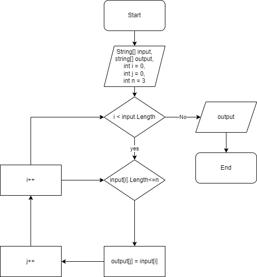

# **Итоговый Проект**

## **Задача**:
Написать программу, которая из имеющегося массива строк формирует массив из строк, длина которых меньше либо равна 3 символа. Первоначальный массив можно ввести с клавиатуры, либо задать на старте выполнения алгоритма. При решении не рекомендуется пользоваться коллекциями, лучше обойтись исключительно массивами.

## **Описание решения**:

1. Заводим исходные переменные.

2. Проверяем если значения исходного массива меньше его длины.

3. В случае если, это подтверждается, то проверяем каждое значение из массива на соответствие условию: длина строки меньше или равна трем.

4. Если строка удовлетворяет условию кладем значение в новый массив.

5. Повторяем пункты 2 - 4 до тех пор пока не достигнем конца исходного массива.

6. Возвращаем новый заполненый массив как результат.

*Here is the place flowchart to be located.*

